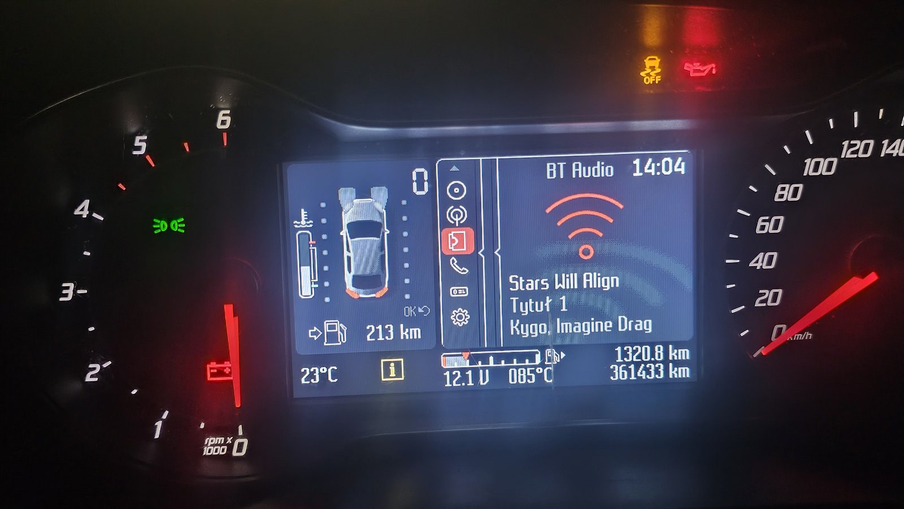

# convers-bt-audio

**Native firmware patch that makes the Ford Convers+ instrument cluster display Bluetooth audio track title & artist — the same way it already does for USB.**

The Convers+ cluster (MCU: NXP **MAC7116**) shows track metadata for USB and CD sources, but the Bluetooth Audio screen stays blank because the firmware never processes the BT metadata CAN messages. This project adds that missing piece **natively in firmware** — no external CAN bridge, no extra hardware, no companion app.

- ✅ Bluetooth track **title** and **artist** now appear on the *BT Audio* screen
- ✅ Reuses the cluster's own, already-working media text pipeline (the USB path)
- ✅ Up to **18 characters** per field
- ✅ Ships as **patch scripts only** — you patch your *own* firmware dump; no Ford binaries are redistributed

> **Tested on:** Ford **Mondeo MK4 facelift (FL), model years 2011+** — Convers+ cluster, firmware **1412-FL**, VBF partition `CS7T-14C026-CD`. Other cars/versions that use the same Convers+ cluster may work, but are currently **unverified** (see [Compatibility](#compatibility)).



*Patched cluster on a Ford Mondeo MK4 FL — the BT Audio screen now shows the live track title ("Stars Will Align") and artist ("Kygo, Imagine Dragons") streamed over Bluetooth.*

---

## ⚠️ DISCLAIMER — READ BEFORE YOU DO ANYTHING

**This modifies the firmware of a safety-related vehicle component. You do this entirely at your own risk.**

- **Bricking is a real possibility.** A bad flash can leave your instrument cluster unbootable. Recovery may require JTAG/BDM hardware and is not guaranteed.
- **You will likely void your warranty** and may violate the terms of your vehicle's software.
- **Always keep a verified, complete backup** of your original firmware **and EEPROM** before flashing anything. Store it somewhere safe.
- Your firmware dump **contains your VIN and other vehicle data** — never upload it publicly.
- This is **not affiliated with, endorsed by, or supported by Ford.** "Ford" and "Convers+" are used only to identify the target hardware.
- The authors accept **no liability** for any damage, loss, or injury. If you are not comfortable reading a disassembler and recovering a bricked ECU, **do not proceed.**

If any of the above scares you — good. Stop here.

---

## Compatibility

| Item | Value |
|------|-------|
| **Confirmed vehicle** | **Ford Mondeo MK4 facelift (FL), 2011+** |
| Cluster | Ford Convers+ IPC |
| MCU | NXP MAC7116 (ARM7TDMI-S, Thumb, **big-endian**, ARMv4T) |
| Firmware base | `0x5000` |
| **Confirmed firmware** | **1412-FL**, VBF partition `CS7T-14C026-CD` |
| Other vehicles / versions | **Untested.** Other Fords using the same Convers+ cluster may work. The patch scripts verify the exact bytes they expect at each hook site and **abort** if they don't match, so they will refuse to patch an incompatible image rather than corrupt it. |

If you have a different firmware version and the scripts abort, please open an issue with your version string — the offsets can usually be ported.

---

## How it works (short version)

Bluetooth sends track metadata over CAN ID `4B1` (source byte `0x12`), as ISO-TP text frames in the format `[field][source][01][01][text]`. Stock firmware treats `4B1` as a dead 2-byte "signal" and throws the text away.

The patch installs a small code cave hooked into the CAN receive path (**before** the message is dispatched by type), which:

1. reads the raw FlexCAN mailbox and filters for CAN ID `4B1`,
2. reassembles the ISO-TP payload (First / Consecutive / Single frames),
3. feeds the completed text into the **same media dispatcher the USB path uses**, which writes it to the Bluetooth metadata store the screen already reads.

A second, tiny patch to the BT Audio screen renderer relocates one string buffer so title and artist can each be up to 18 characters without one overwriting the other.

Full technical write-up: **[docs/HOW_IT_WORKS.md](docs/HOW_IT_WORKS.md)**.

---

## Requirements

- **Python 3.8+**
- A way to **read and write** your cluster's firmware (e.g. via the bootloader / a VBF flasher). This project does **not** flash for you — it only produces the patched image.
- Optional, for verifying/experimenting: [Capstone](https://www.capstone-engine.org/) (`pip install capstone`) and [Unicorn](https://www.unicorn-engine.org/) (`pip install unicorn`) if you want to disassemble or emulate.

Community resources for dumping and flashing Convers+ clusters can be found on the [microhacker forum](https://microhacker.denkdose.de/).

---

## Usage

> All commands take **explicit file paths**. Nothing is committed to this repo — you work on your own dump locally (see `.gitignore`).

**0. Back up first.** Dump your firmware *and* EEPROM and keep verified copies.

**1. Extract the code partition** from your firmware image (the `0x5000`-based program image). If your dump already is that image, use it directly as `main.bin`.

**2. Apply the CAN patch (BT metadata → media store):**
```bash
python tools/apply_patch_v3.py main.bin main_patched.bin
```
The script prints the hook it found and asserts it matches before writing. If it aborts with a mismatch, your firmware version differs — stop and open an issue.

**3. Apply the renderer patch (18-character fields):**
```bash
python tools/apply_render_18.py main_patched.bin main_patched.bin
```

**4. Repack into a flashable VBF**, using your original VBF as the template (keeps the correct part number, address and CRCs):
```bash
python tools/vbf_tool.py pack original.vbf main_patched.bin main_patched.vbf
```

**5. Flash `main_patched.vbf`** with your usual tool, then play a Bluetooth track and open the *BT Audio* screen.

---

## Limitations

- **18 characters max** per field. This is a hard limit of the stock renderer's on-stack buffers; going higher would require patching the drawing code more invasively.
- Handles **`4B1` only** (not `4B0`). The two carry the same text but interleave at the frame level; processing both corrupts the shared reassembly buffer. `4B1` alone is complete.
- **Album** is reassembled too, but many clusters don't show an album field on the BT screen.
- Tested on one firmware variant (see Compatibility).

---

## Repository layout

```
tools/
  apply_patch_v3.py    CAN 4B1 → media store code cave (hook @0x236f6, cave @0x83240)
  apply_render_18.py   BT Audio renderer patch (18-char title/artist)
  vbf_tool.py          VBF pack/unpack (CRC16-CCITT + CRC32)
docs/
  HOW_IT_WORKS.md      full reverse-engineering write-up
  FLASHING.md          dump → patch → pack → flash walkthrough
```

## Contributing

Issues and PRs welcome — especially ports to other firmware versions (please include your version string and the bytes the scripts report). Please **never** attach firmware dumps or VBF files to issues; they contain Ford code and your VIN.

## License

[MIT](LICENSE) © 2026 andrzejogh

Not affiliated with Ford Motor Company. Trademarks belong to their respective owners.
